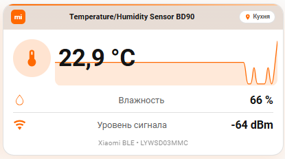
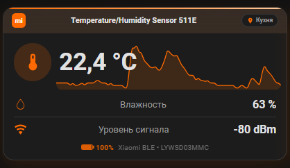

# 🌡️ Xiaomi Climate Card для Home Assistant

Одна универсальная карточка дашборда (Lovelace) для BLE-датчиков температуры/влажности
Xiaomi (LYWSD03MMC и аналогов): фирменный «оранжевый» стиль Xiaomi, фоновый график
температуры за 24 часа, комната датчика и автоматическая поддержка светлой/тёмной темы HA.




## ✨ Возможности

- 🟠 Фирменный стиль Xiaomi: акцент-полоска, градиенты, палитра `#FF6900`
- 🌡️ Крупная температура + фоновый график истории (24 ч) под строкой значения
- 💧 Влажность и 📶 уровень сигнала — авто-поиск сущностей того же устройства
- 📍 Комната: из области (area) устройства в HA или fallback-значение
- 🌗 Темизация: карточка сама красится под светлую/тёммую тему (`var(--…)`)
- 🧩 Компактный размер, устойчива к `unavailable` (показывает «—»)
- 🔁 Универсальность: для нового датчика достаточно заменить одну строку `entity`

## 🧩 Требования

- Home Assistant 2024.x и новее
- Компоненты из HACS (Frontend):
  - [button-card](https://github.com/custom-cards/button-card)
  - [mini-graph-card](https://github.com/kalkih/mini-graph-card)
  - [card-mod](https://github.com/thomasloven/lovelace-card-mod)

## 🚀 Установка

1. Установите три компонента выше через **HACS → Frontend**.
2. Скопируйте код из `xiaomi-climate-card.yaml` (или из блока ниже).
3. Дашборд → Редактировать → Добавить карточку → **Редактор кода (YAML)** → вставить.
4. Замените строки, помеченные подсказками `(Укажите …)`, на свои значения.

## ⚙️ Настройка

| Что заменить | Где | Пример |
|---|---|---|
| `(Укажите устройство)` | строка `entity:` и блок `graph → card → entities` | `sensor.kukhnia_temperature_humidity_sensor_bd90_temperature` |
| `(Укажите комнату)` | `variables.room_fallback` | `Кухня` (показывается, если у устройства не задана область) |

Остальное (имя устройства, влажность, сигнал, комната) карточка определяет сама
из реестра HA (`hass.entities / hass.devices / hass.areas`).

## 📄 Код карточки

```yaml
type: custom:button-card
entity: (Укажите устройство)   # ← entity_id температурного сенсора
variables:
  room_fallback: (Укажите комнату)   # ← fallback, если в HA не назначена область
show_name: false
show_state: false
show_label: true
show_icon: true
icon: mdi:thermometer
tap_action:
  action: none
label: >-
  [[[ return (entity && entity.state !== 'unavailable' && entity.state !== 'unknown')
      ? entity.state.replace('.', ',') + ' °C' : '—'; ]]]
styles:
  card:
    - position: relative
    - border-radius: 20px
    - background-color: 'var(--ha-card-background-color, var(--card-background-color, #ffffff))'
    - box-shadow: 0 12px 32px rgba(255,105,0,0.12)
    - padding: 0
    - overflow: hidden
  grid:
    - grid-template-areas: '"header header" "i s" "hum hum" "rssi rssi" "footer footer"'
    - grid-template-columns: auto 1fr
    - grid-template-rows: auto auto auto auto auto
  icon:
    - grid-area: i
    - width: 36px
    - height: 36px
    - padding: 16px
    - border-radius: 50%
    - background: 'rgba(255,105,0,0.18)'
    - color: '#ff6900'
    - margin: 18px 0 18px 18px
    - position: relative
    - z-index: 1
  label:
    - grid-area: s
    - font-size: 44px
    - font-weight: 700
    - color: 'var(--primary-text-color)'
    - align-self: center
    - justify-self: start
    - padding-left: 14px
    - line-height: 1
    - letter-spacing: -0.5px
    - position: relative
    - z-index: 1
  custom_fields:
    accent:
      - position: absolute
      - top: 0
      - left: 0
      - right: 0
      - height: 3px
      - z-index: 2
      - pointer-events: none
    header:
      - grid-area: header
      - position: relative
      - z-index: 1
    graph:
      - position: absolute
      - top: 48px
      - left: 94px
      - right: 10px
      - height: 104px
      - z-index: 0
      - pointer-events: none
      - border-radius: 14px
      - overflow: hidden
      - '--ha-card-background-color: transparent'
      - '--ha-card-background: transparent'
      - '--card-background-color: transparent'
      - '--paper-card-background-color: transparent'
      - '--ha-card-box-shadow: none'
      - '--card-box-shadow: none'
      - '--ha-card-border-width: 0'
    hum:
      - grid-area: hum
      - position: relative
      - z-index: 1
    rssi:
      - grid-area: rssi
      - position: relative
      - z-index: 1
    footer:
      - grid-area: footer
      - position: relative
      - z-index: 1
custom_fields:
  accent: |
    <div style="height:3px;background:linear-gradient(90deg,#ff6900 0%,#ff9a4d 55%,#ffc89a 100%);"></div>
  graph:
    card:
      type: custom:mini-graph-card
      entities:
        - entity: (Укажите устройство)   # ← тот же температурный сенсор
      hours_to_show: 24
      points_per_hour: 4
      line_width: 2
      line_color: '#ff6900'
      height: 104
      show:
        name: false
        icon: false
        state: false
        legend: false
        points: false
        labels: false
        fill: true
      fill_opacity: 25
      card_mod:
        style: |
          ha-card {
            background: transparent !important;
            box-shadow: none !important;
            border: none !important;
          }
  header: |
    [[[ const reg = hass.entities ? hass.entities[entity.entity_id] : null;
        const dev = (reg && reg.device_id && hass.devices) ? hass.devices[reg.device_id] : null;
        const title = dev ? (dev.name_by_user || dev.name) : entity.entity_id;
        const areaId = (reg && reg.area_id) || (dev && dev.area_id);
        const room = (areaId && hass.areas && hass.areas[areaId]) ? hass.areas[areaId].name : (variables.room_fallback || '');
        return `<div style="display:flex;align-items:center;gap:8px;background-color:var(--secondary-background-color,#e8e8e8);background-image:linear-gradient(rgba(255,105,0,0.07),rgba(255,105,0,0.07));padding:10px 14px;">
          <div style="width:26px;height:26px;background:#ff6900;border-radius:7px;color:#fff;font-weight:700;display:flex;align-items:center;justify-content:center;font-family:Arial,sans-serif;font-size:12px;flex-shrink:0;">mi</div>
          <div style="flex:1;min-width:0;font-size:14px;line-height:1.25;font-weight:600;color:var(--primary-text-color);display:-webkit-box;-webkit-line-clamp:2;-webkit-box-orient:vertical;overflow:hidden;">${title}</div>
          <div style="display:flex;align-items:center;gap:4px;background:var(--card-background-color,#ffffff);border:1px solid var(--divider-color);border-radius:999px;padding:4px 9px;font-size:11px;font-weight:600;color:var(--secondary-text-color);flex-shrink:0;white-space:nowrap;">
            <svg style="width:12px;height:12px;fill:#ff6900;" viewBox="0 0 24 24"><path d="M12,11.5A2.5,2.5 0 0,1 9.5,9A2.5,2.5 0 0,1 12,6.5A2.5,2.5 0 0,1 14.5,9A2.5,2.5 0 0,1 12,11.5M12,2A7,7 0 0,0 5,9C5,14.25 12,22 12,22C12,22 19,14.25 19,9A7,7 0 0,0 12,2Z"/></svg>
            ${room}
          </div>
        </div>`; ]]]
  hum: |
    [[[ const reg = hass.entities ? hass.entities[entity.entity_id] : null;
        let hid = null;
        if (reg && reg.device_id) {
          for (const [id, e] of Object.entries(hass.entities)) {
            if (e.device_id === reg.device_id && id.endsWith('_humidity')) { hid = id; break; }
          }
        }
        const h = hid ? states[hid] : null;
        const v = (h && h.state !== 'unavailable' && h.state !== 'unknown') ? h.state.replace('.', ',') : '—';
        return `<div style="display:flex;align-items:center;margin:12px 18px 0 18px;padding-bottom:10px;border-bottom:1px solid var(--divider-color);">
          <svg style="width:24px;height:24px;fill:#ff6900;" viewBox="0 0 24 24"><path d="M12,20A6,6 0 0,1 6,14C6,10 12,3.5 12,3.5C12,3.5 18,10 18,14A6,6 0 0,1 12,20M12,2C12,2 5,10 5,14A7,7 0 0,0 19,14C19,10 12,2 12,2Z"/></svg>
          <span style="flex:1;margin-left:12px;font-size:16px;color:var(--secondary-text-color);">Влажность</span>
          <span style="font-size:20px;font-weight:700;color:var(--primary-text-color);">${v} %</span>
        </div>`; ]]]
  rssi: |
    [[[ const reg = hass.entities ? hass.entities[entity.entity_id] : null;
        let sid = null;
        if (reg && reg.device_id) {
          for (const [id, e] of Object.entries(hass.entities)) {
            if (e.device_id === reg.device_id && (id.endsWith('_signal_strength') || id.endsWith('_rssi'))) { sid = id; break; }
          }
        }
        const s = sid ? states[sid] : null;
        const v = (s && s.state !== 'unavailable' && s.state !== 'unknown') ? s.state : '—';
        return `<div style="display:flex;align-items:center;margin:0 18px;padding:10px 0;">
          <svg style="width:24px;height:24px;fill:#ff6900;" viewBox="0 0 24 24"><path d="M12,21L15.6,16.2C14.6,15.45 13.35,15 12,15C10.65,15 9.4,15.45 8.4,16.2L12,21M12,3C7.95,3 4.21,4.34 1.2,6.6L3,9C5.5,7.13 8.62,6 12,6C15.38,6 18.5,7.13 21,9L22.8,6.6C19.79,4.34 16.05,3 12,3M12,9C9.3,9 6.81,9.89 4.8,11.4L6.6,13.8C8.1,12.67 9.97,12 12,12C14.03,12 15.9,12.67 17.4,13.8L19.2,11.4C17.19,9.89 14.7,9 12,9Z"/></svg>
          <span style="flex:1;margin-left:12px;font-size:16px;color:var(--secondary-text-color);">Уровень сигнала</span>
          <span style="font-size:20px;font-weight:700;color:var(--primary-text-color);">${v} dBm</span>
        </div>`; ]]]
  footer: |
    <div style="text-align:center;color:var(--secondary-text-color);opacity:0.7;font-size:13px;padding:2px 0 14px 0;">Xiaomi BLE • LYWSD03MMC</div>
```

## 🎨 Кастомизация

| Что крутить | Где | Эффект |
|---|---|---|
| `fill_opacity` (10–30) | mini-graph-card | плотность заливки графика |
| `line_width`, `hours_to_show` | mini-graph-card | толщина линии / глубина истории |
| `top / left / right / height` | `styles → custom_fields → graph` | положение и размер фонового графика |
| `font-size` в `label` | `styles → label` | размер цифры температуры |
| `width/height/padding/margin` в `icon` | `styles → icon` | размер круга термометра |

## 🌗 Темы

Все цвета фона и текста берутся из переменных темы HA
(`--ha-card-background-color`, `--primary-text-color`, `--secondary-text-color`,
`--divider-color`, `--secondary-background-color`), поэтому карточка автоматически
выглядит нативно и в светлой, и в тёмной теме. Оранжевые акценты (`#FF6900`) — фиксированные.

## 📄 Лицензия

MIT — см. [LICENSE](LICENSE). Используйте, меняйте, делитесь.
